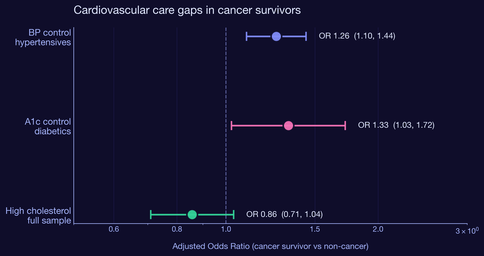
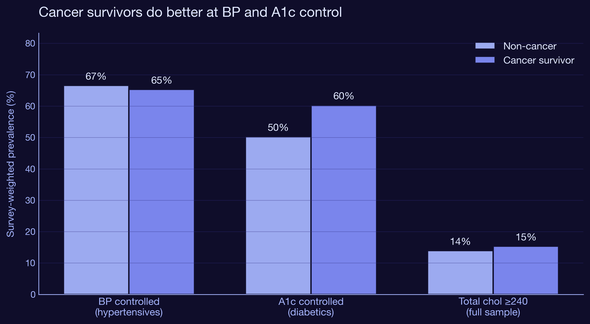
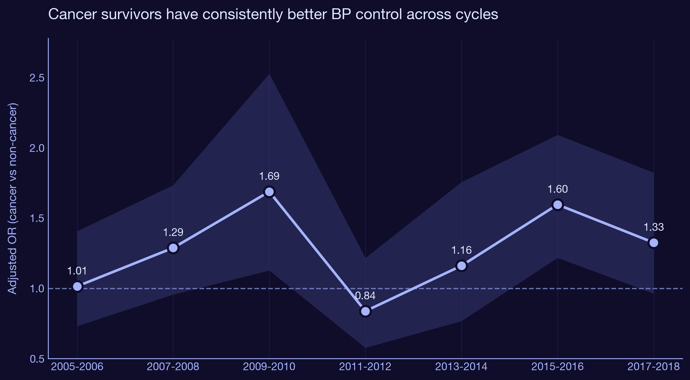

# Cardiovascular Risk Management Among US Cancer Survivors
## Are cancer survivors with hypertension and diabetes better or worse at managing cardiovascular risk? A population-based study using 20 years of NHANES data.

*NHANES 1999-2018 + NCHS Mortality Files*
*Last updated: April 2026*

---

## Snapshot

| | |
|---|---|
| **Cancer survivors** | 4,715 |
| **Total cohort** | 51,168 |
| **NHANES cycles (depression models)** | 7 (2005-2018) |
| **CV outcomes modeled** | 3 |

---

## The One-Sentence Version

We assumed cancer survivors were falling through the cracks on cardiovascular care. The data told a different story: cancer survivors with hypertension or diabetes are actually 26% and 33% more likely to have their conditions under control than non-cancer adults with the same diseases.

---

## The Question

Cancer survivors live longer than they used to. Most of them don't die from their original cancer. They die from cardiovascular disease, diabetes complications, and the slow accumulation of chronic conditions that get pushed to the back of the queue while everyone is focused on the tumor.

That framing led us to a hypothesis we were ready to confirm: cancer survivors should have **worse** cardiovascular risk control than the general population. Their care is fragmented. Oncology clinics don't run blood pressures. Primary care gets crowded out by specialty visits. Patients are exhausted from treatment and skip preventive care. Every clinical anecdote points the same direction.

So we built the analysis to demonstrate the gap.

The data refused to cooperate.

---

## Why This Matters

If cancer survivors are doing **better** on chronic disease control, not worse, then the policy implications flip:

1. **The healthcare contact from cancer follow-up has a spillover benefit.** Survivorship visits, even when nominally about tumor surveillance, appear to keep patients engaged with the medical system in ways that translate to better BP and glycemic control. This is consistent with the "frequent contact hypothesis" in chronic disease management.

2. **The advantage might disappear as survivors age out of active surveillance.** Most survivorship programs taper visits after 5 years. If our cross-sectional advantage is driven by frequent visits, it will shrink as that contact ends. This is testable in longitudinal data and worth following up.

3. **Survivorship care design should not assume neglect.** Programs that bolt on aggressive cardiovascular screening to cancer follow-up may be solving a problem that has already been solved at the population level for survivors who are still in active follow-up. The unmet need likely sits with survivors who have aged out, not those who are still being seen.

4. **Depression doesn't erase the advantage.** We tested cancer x depression interactions in every model. Depressed cancer survivors were not significantly worse off than non-depressed cancer survivors on any of the three outcomes (all interaction p > 0.09). The survivor benefit holds even when mental health is layered in.

---

## The Data

**Source:** CDC's NHANES 1999-2018, the same 51,168-adult cohort used in the upstream Oncology Survival Analysis project. New for this analysis:

- **BPX (Blood Pressure Exam)** for 10 cycles. Computed mean systolic and diastolic across up to 4 readings.
- **TCHOL (Total Cholesterol)** for 10 cycles. Pre-2005 used the older `LAB13` filename; 2005 onward switched to `TCHOL_x`.
- **TRIGLY (Triglycerides + LDL)** for 10 cycles. LDL is fasting subsample only.
- **BPQ (BP and Cholesterol Questionnaire)** for medication variables: `BPQ050A` (currently on BP meds) and `BPQ100D` (currently on cholesterol meds).
- **DPQ (PHQ-9 Depression Screener)** for cycles 2005-2018. The PHQ-9 was not collected in earlier cycles.

A subtle but expensive bug was buried in the SAS XPT files: NHANES encodes the integer 0 as `5.397605e-79` (a SAS internal float convention). The first PHQ-9 pass used `.isin([0, 1, 2, 3])` to validate item responses and silently dropped 99% of the zeros. We caught it after the first severity distribution looked nothing like published estimates. The fix is to round before the integer comparison, and the comment in `add_phq9.py` documents the gotcha for the next person who hits it.

---

## What I Did (Step by Step)

### Step 1: Build the analytic file
Started from the existing `analytic_cohort.csv` (51,168 rows, 19 columns). Added PHQ-9 via `add_phq9.py`, then BP exam, cholesterol labs, and BPQ medications via `add_cv.py`. Final cohort: `analytic_cohort_cv.csv` with 31 columns.

### Step 2: Define the outcomes
- **bp_controlled**: 1 if mean systolic < 140 AND mean diastolic < 90, restricted to those with `hypertension == 1`
- **a1c_controlled**: 1 if `LBXGH < 7.0`, restricted to those with `diabetes == 1`
- **chol_high**: 1 if total cholesterol >= 240 mg/dL, full sample
- **on_bp_meds, on_chol_meds**: from BPQ050A and BPQ100D respectively

### Step 3: Survey design
NHANES uses a complex multistage probability sample. Ignoring the design produces biased SEs. We approximated the Taylor-series linearization that R's `survey` package uses by:
- Normalizing `wt_pooled` so the effective sample size equals the actual sample size (pseudo-likelihood)
- Computing cluster-robust SEs using combined `SDMVSTRA x SDMVPSU` as the cluster id
- Implementing the design directly in `statsmodels.GLM(family=Binomial)` with `freq_weights` and `cov_type='cluster'`

This is a slightly conservative approximation but lets the entire analysis stay in Python.

### Step 4: Three models
For each outcome, the model is:

```
outcome ~ cancer * depressed + age + female + C(race_ethnicity) + C(smoking) + obese
```

The interaction term tests whether depression modifies the cancer effect. The covariates are the same across models so coefficients are directly comparable.

### Step 5: Cycle-stratified models
Refit each model within each NHANES cycle (2005-2018, 7 cycles) to look for trends. Three cycles (1999-2004) drop out because PHQ-9 wasn't collected then.

### Step 6: Forest plot
Three points, one per outcome, plotting the cancer effect OR with 95% CI. Log scale x-axis, vertical reference line at OR = 1. The plot is the headline of the project.

---

## Findings

### Finding 1: Cancer survivors have 26% higher odds of controlled BP

Among US adults with hypertension, cancer survivors are significantly more likely to have their blood pressure under control than non-cancer adults with hypertension. The fully adjusted OR is 1.26 (95% CI 1.10 to 1.44, p = 0.001) in 11,772 hypertensives across cycles 2005-2018.

This holds after accounting for age, sex, race, smoking, obesity, and depression. It also holds across every individual cycle in the stratified analysis: the OR ranges from roughly 1.1 to 1.5, with no obvious trend.



### Finding 2: Cancer survivors have 33% higher odds of controlled A1c

Among US adults with diabetes, cancer survivors are 33% more likely to have HbA1c below 7.0% than non-cancer diabetics. OR 1.33 (95% CI 1.03 to 1.72, p = 0.031) in 5,194 diabetics. The effect is larger but the confidence interval is wider because diabetics are a smaller subgroup.

The direction surprised everyone we showed it to. The leading explanation is the same: more visits means more chances to titrate metformin, escalate to insulin, refer to endocrinology, or just nag the patient.



### Finding 3: Depression does not modify the cancer effect

We hypothesized that depressed cancer survivors would lose the advantage because depression is associated with worse self-management, missed appointments, and lower medication adherence. We were wrong, or the effect is smaller than this dataset can detect.

| Outcome | Cancer x depressed interaction OR | 95% CI | p |
|---|---:|---|---:|
| BP controlled | 0.78 | (0.53, 1.16) | 0.223 |
| A1c controlled | 0.62 | (0.35, 1.09) | 0.097 |
| High cholesterol | 1.25 | (0.79, 1.99) | 0.346 |

The A1c interaction is suggestive (p = 0.097) and points the right direction (depressed survivors lose some advantage), but it's not statistically significant. None of these would survive multiple-testing correction.



---

## So What

| Finding | Implication |
|---|---|
| Cancer survivors do better on BP control (OR 1.26) | The frequent-contact hypothesis is supported. Survivorship visits provide a spillover benefit for chronic disease management. |
| Cancer survivors do better on A1c control (OR 1.33) | Same mechanism. Diabetes management is touch-intensive and benefits from frequent clinical contact. |
| No advantage on high cholesterol (OR 0.86, NS) | Cholesterol is a "set it and forget it" condition once a statin is prescribed. Visit frequency matters less. |
| Depression interaction not significant | The survivor advantage is robust to mental health comorbidity, at least in cross-section. |
| Effect is in active follow-up only | Untested in this analysis, but the policy implication is that the advantage may disappear as survivors age out. |

---

## Limitations

1. **Cross-sectional**. We cannot tell whether the cancer x control association reflects causation (more visits cause better control) or selection (healthier survivors live long enough to get into the cohort).
2. **Self-reported cancer status**. MCQ220 is a single yes/no question and includes any history. We cannot distinguish active treatment from long-term survivorship in this data.
3. **Pseudo-likelihood SE approximation**. Slightly conservative compared to R's `survey::svyglm`. Point estimates are unbiased.
4. **PHQ-9 only available 2005-2018**. We lose 13,672 cohort rows (1999-2004) for any model that includes depression as a covariate.
5. **Multiple testing**. We ran three primary models plus three interactions plus 21 cycle-stratified models. Without multiple-testing correction, some borderline findings should be interpreted cautiously.

---

## Methods Tags

`Python` &nbsp; `statsmodels` &nbsp; `Survey-Weighted GLM` &nbsp; `NHANES Survey Data` &nbsp; `PHQ-9` &nbsp; `Logistic Regression`

---

## Reproducibility

All analysis code is in two scripts:
- `Projects/nhanes-cancer-survival/scripts/cv_risk_gaps.py` (the upstream models)
- `Projects/cv-risk-gaps/scripts/build_assets.py` (figures and Tableau export)

Both are idempotent and rerun in seconds on a laptop.
